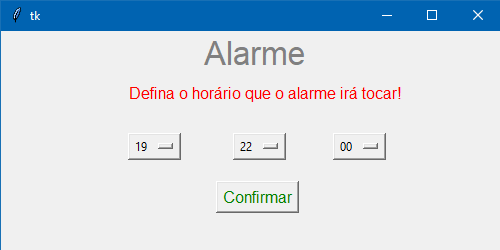

# Alarme Sonoro
> Projeto que cria um protótipo inicial de alarme sonoro

Este projeto basicamente é um alarme sonoro definido pelo usuário através de uma interface. Logo mais tentarei atualizar o projeto conectando-o a um banco de dados MySQL para salvar mais de um horário definido de alarme.

---

## Módulos utilizados
Os módulos utilizados foram datetime, playsound, time e tkinter.
Instalando tkinter:
`pip install tkinter`
Instalando playsound:
`pip install playsound`

## Uso
Este projeto serve para trabalhar com interfaces gráficas simples, aprendendo a montar uma, além de trabalhar com as bibliotecas playsound e datetime, manipulando data e hora. Além disso, pode ser otimizado com um banco de dados para se criar um despertador comum.

## Meta
Gregory Wells de Carvalho Barteles - gregorywells93@gmail.com.